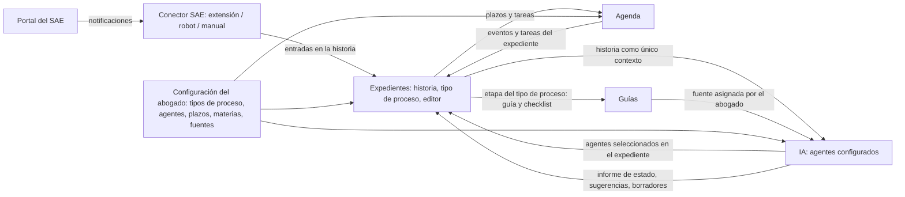

# 00 — Visión

## 1. El problema

El abogado litigante en Tucumán trabaja hoy con varias herramientas desconectadas:

- El **Portal del SAE** (Sistema de Administración de Expedientes del Poder Judicial) para consultar expedientes, recibir notificaciones electrónicas y presentar escritos.
- Un calendario personal donde anota audiencias y vencimientos, computados a mano en días hábiles judiciales.
- Carpetas de archivos con escritos, cédulas, proveídos y pericias.
- Trámites paralelos al proceso: mediación prejudicial (Ley 7844), tasa de justicia, aportes a la Caja de Previsión, bono del Colegio, regulación de honorarios (Ley 5480).
- Conocimiento procesal que cambió con el nuevo **CPCC Ley 9531** (vigente desde el 1/11/2022, modificado por Leyes 9593, 9608, 9683 y 9712) y que obliga a reaprender plazos, estructura de los procesos y oralidad.

El costo de esta dispersión es concreto: plazos que se pierden, escritos que se redactan desde cero, información del expediente que hay que releer cada vez, notificaciones que se transcriben a mano y trámites administrativos que se olvidan.

## 2. La propuesta

Un **estudio jurídico virtual** donde el **expediente es el eje**, su **historia se construye dentro de la app** (actuaciones del juzgado traídas del SAE, escritos redactados allí mismo, documentos, eventos, notas) y **agentes de IA configurados por el abogado** lo asisten en cada etapa: analizan, cuentan plazos, informan el estado, advierten y proponen.

El sistema no reemplaza el criterio del abogado: organiza, calcula, sugiere y redacta borradores; el abogado revisa y decide. Y los agentes no saben más de lo que el abogado les dio: trabajan en dominio cerrado sobre la historia del expediente y las fuentes que él cargó.

Cuatro áreas:

| Área | Qué hace | Documento |
|---|---|---|
| **Agenda** | Calendario, tareas, vencimientos procesales computados automáticamente, contactos, honorarios y gastos | 01 |
| **Expedientes** | Ficha configurada por tipo de proceso, historia unificada, editor de escritos, agentes seleccionados, estado | 02 |
| **IA** | Uso de los agentes: conversaciones con contexto del expediente e informes de estado | 03 |
| **Guías** | Base de conocimiento propia sobre derecho sustantivo/procesal y sobre trámites administrativos del proceso | 04 |

Y un área transversal: **Configuración**, donde el abogado define sus catálogos —tipos de proceso con sus etapas, agentes especializados, plazos, escritos, materias, juzgados— y los datos del estudio. Los agentes se **crean acá** y se **seleccionan** después en cada expediente.

Más tres piezas transversales documentadas aparte: la **integración Expedientes e IA** (05), el **conector con el Portal del SAE** (09) y la **normalización de texto** (10).

## 3. Principios de diseño

1. **El expediente es la fuente de verdad.** Todo (tareas, vencimientos, escritos, conversaciones con IA, documentos, checklists, informes) cuelga de un expediente y queda en su historia, o se marca explícitamente como "general del estudio".
2. **El abogado configura.** Tipos de proceso y sus etapas, catálogo de plazos, plantillas de escritos, materias, agentes, y las fuentes y guías de comportamiento de cada agente son configuración suya, y se crean, editan y borran desde el área Configuración. El sistema trae ejemplos editables, nunca reglas fijas.
3. **Dominio cerrado: el agente solo sabe lo que el abogado le dio.** Su campo de funcionamiento es la historia del expediente donde fue seleccionado y las fuentes que tiene asignadas. No usa conocimiento general del modelo para afirmar derecho, plazos ni hechos. Toda afirmación lleva cita verificada; sin fuente, el agente dice que no la encuentra. Los plazos los calcula exclusivamente el motor de plazos.
4. **Un solo formato para todo lo que se carga.** Lo que escribe el abogado y lo que entra por importación se guarda normalizado y ortográficamente correcto: "NICOLAS ROGEL C/ SWISS MEDICAL ART S/ daños y Perjuicios" queda como "Nicolás Rogel c/ Swiss Medical ART s/ Daños y Perjuicios". No es cosmético: una carátula escrita de tres maneras es tres carátulas para buscar, ordenar y deduplicar contra el SAE (`10-normalizacion-de-texto.md`).
5. **La IA propone, el abogado decide.** Ninguna acción con efecto se ejecuta sin aprobación. Las sugerencias quedan en una bandeja hasta que se aceptan o descartan; las que no tienen fuente se muestran como observación, no como acción.
6. **Los plazos se computan en días hábiles judiciales de Tucumán.** Feriados nacionales, feriados provinciales, ferias de enero y julio (la Acordada 840/26 fija el cronograma 2026–2038), asuetos por acordada, reglas de notificación digital y de presentaciones fuera de horario. El motor de plazos es un módulo aislado y testeable.
7. **Las actuaciones del juzgado entran solas.** El conector con el Portal del SAE (extensión de navegador primero, robot opcional después) lleva las notificaciones a la historia del expediente y dispara el análisis y el cómputo de plazos.
8. **Confidencialidad.** Datos bajo secreto profesional; políticas de acceso por fila; a los proveedores de IA solo van los fragmentos necesarios de la consulta en curso; sin credenciales del Portal almacenadas salvo activación explícita del robot.
9. **Monousuario hoy, multiusuario mañana.** Sin roles en el MVP, pero el modelo de datos no lo impide.
10. **Configuración y guías vivas.** La normativa cambia; fuentes, plazos y guías tienen fecha de revisión y pueden marcarse "necesita revisión".

## 4. Mapa de áreas y cómo se cruzan

## 5. Usuario y contexto de uso

- **Quién:** un abogado matriculado en Tucumán que litiga principalmente en el fuero Civil y Comercial, en los Centros Judiciales de Capital, Concepción o Monteros.
- **Cuándo:** todos los días, al revisar notificaciones del SAE, al preparar escritos y audiencias, al planificar la semana.
- **Dónde:** escritorio (uso principal, con la extensión instalada) y teléfono (consulta rápida de agenda y estado de expedientes).
- **Qué ya usa:** Portal del SAE, correo, WhatsApp con clientes, Word, calendario de Google.

## 6. Alcance del MVP (resumen)

- Configuración propia: tipos de proceso con sus etapas, agentes, catálogo de plazos, plantillas de escritos, materias.
- Expedientes con tipo de proceso, historia unificada, editor de escritos con IA e import/export Word.
- Normalización uniforme de todo lo que se carga.
- Agenda con vencimientos calculados por el motor y calendario de ferias precargado.
- Agentes creados por el abogado (cinco ejemplos editables), seleccionados por expediente, con informe de estado, dominio cerrado y verificación de citas.
- Conector SAE por extensión de navegador, con carga manual como respaldo.
- Entre 8 y 10 guías de ejemplo.

Fuera del MVP: robot SAE, informe automático al llegar notificaciones, multiusuario, portal de clientes.

## 7. Glosario

| Término | Significado en este proyecto |
|---|---|
| **Expediente / causa** | Proceso judicial identificado por número, año y carátula ante un juzgado determinado. |
| **Carátula** | Denominación del expediente: "Actor c/ Demandado s/ Objeto". Se guarda normalizada y con sus tres componentes por separado. |
| **Tipo de proceso** | Configuración del abogado que define, para una clase de juicio (ordinario, sumario, expropiación…), sus etapas, transiciones, plazos típicos, escritos típicos, guías y agentes sugeridos. En el modelo de datos es la tabla `process_templates`; en documentos anteriores figuraba como "plantilla de proceso". |
| **Etapa procesal** | Estado del expediente dentro de su tipo de proceso (por ejemplo "prueba"). |
| **Materia / especialidad** | Rama de fondo de la causa o del agente: daños y perjuicios, consumidor, prescripción, contratos, etc. |
| **Historia del expediente** | Línea de tiempo única del expediente: actuaciones del juzgado, escritos propios, documentos, eventos, notas, cambios de etapa, informes de agentes. Es el único contexto fáctico de los agentes. El SAE usa el mismo nombre para su línea de tiempo. |
| **Actuación** | Entrada de la historia originada en el juzgado o en la contraria: proveído, cédula, resolución, sentencia, audiencia, pericia. |
| **Proveído / decreto** | Resolución simple del juzgado que impulsa el trámite (por ejemplo "traslado por diez días"). |
| **Cédula / notificación digital** | Acto por el que se notifica una resolución. En Tucumán se cursa por el Portal del SAE al domicilio electrónico. |
| **Vencimiento** | Fecha límite de un plazo procesal, computada por el motor de plazos en días hábiles desde la notificación. |
| **Plazo de gracia** | Extensión del plazo a las primeras horas del día hábil siguiente **[a confirmar régimen exacto en Ley 9531]**. |
| **Feria judicial** | Período de receso: enero completo y dos semanas en julio (2026: 13 al 26 de julio, Acordada 609/26). Atención de urgencias de 8 a 13 h (art. 164 Ley 6238). |
| **SAE / Portal del SAE** | Sistema de Administración de Expedientes del Poder Judicial de Tucumán (Acordada 640/15) y su interfaz web para abogados, con bandeja de notificaciones, consulta de expedientes y estrado judicial. |
| **Conector SAE** | Conjunto de vías (extensión de navegador, robot opcional, carga manual) por las que las notificaciones del Portal entran a la historia del expediente. |
| **Mediación prejudicial** | Instancia previa y obligatoria (Ley 7844, Decreto 2960/2009) ante el Centro de Mediación Judicial **[a confirmar interacción con Ley 9531]**. |
| **Agente** | Configuración de IA creada por el abogado: rol, rama, especialidad, tipos de proceso, instrucciones y guías de comportamiento, fuentes asignadas, herramientas, modo de conocimiento, modelo. |
| **Dominio cerrado** | Restricción por la que un agente solo responde con base en la historia del expediente y en las fuentes que el abogado le asignó. |
| **Fuente** | Norma, guía, plantilla, fallo o texto propio que el abogado carga y asigna a un agente. |
| **Guía de comportamiento** | Instrucciones libres del abogado que fijan cómo debe actuar un agente. |
| **Normalización** | Formateo automático de lo que se carga, según qué es el dato: nombre propio, título o texto libre (`10-normalizacion-de-texto.md`). |
| **Informe de estado** | Salida estructurada de un agente sobre un expediente: estado, pendientes, plazos, advertencias, propuestas, cada uno con fuente. |
| **Sugerencia de IA** | Propuesta de acción con evidencia verificada, pendiente de aprobación. Sin evidencia se muestra como observación. |
| **Cobertura** | Proporción de lo afirmado por un agente que tiene cita verificada. |
| **RAG** | Retrieval-Augmented Generation: la IA responde apoyándose en fragmentos recuperados de las fuentes habilitadas. |
| **Guía** | Documento propio en Markdown, de la colección Derecho o Trámites, con metadatos, cuerpo y checklist. |
| **Checklist** | Lista de pasos de una guía o de una etapa que puede instanciarse dentro de un expediente. |
