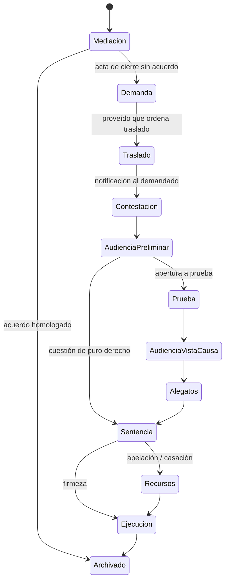

# 02 — Área Expedientes

## 1. Descripción

Es el núcleo del sistema. Cada expediente reúne todo lo que el abogado necesita saber y hacer sobre una causa: ficha identificatoria, partes, **plantilla de proceso con sus etapas**, la **historia del expediente** (todo lo que pasó, en una sola línea de tiempo), escritos redactados en la app, documentos, vencimientos, tareas, gastos, checklists de trámites y los **agentes seleccionados** para trabajar en esa causa.

El objetivo es que al abrir un expediente el abogado responda en segundos tres preguntas: **¿en qué estado está?**, **¿qué vence y cuándo?**, **¿qué tengo que hacer ahora?** Y que cualquier agente que él seleccione pueda responderlas también, apoyándose solo en la historia de ese expediente y en las fuentes que el abogado le dio.

Principio rector de esta área: **el abogado configura**. Las plantillas de proceso, sus etapas, los plazos típicos y los agentes disponibles son configuración suya. El sistema trae ejemplos iniciales editables, nunca reglas fijas.

## 2. Desarrollo

### 2.1 Alta y configuración del expediente

Al crear un expediente el abogado elige el **tipo de proceso**, y con eso el sistema instancia la **plantilla de proceso** correspondiente con sus etapas. La plantilla define cómo se comporta el expediente de ahí en adelante.

**Ficha**

| Campo | Detalle |
|---|---|
| Número y año | Formato del SAE (por ejemplo `1234/26`). Único por juzgado. |
| Carátula | "ACTOR c/ DEMANDADO s/ TIPO DE PROCESO". Se genera desde las partes y puede editarse. |
| Centro judicial | Capital, Concepción, Monteros. |
| Fuero | Civil y Comercial Común, Civil en Documentos y Locaciones, Cobros y Apremios, Familia y Sucesiones, Paz **[a confirmar denominaciones actuales]**. |
| Juzgado y secretaría | Referencia a un contacto de tipo juzgado. |
| **Plantilla de proceso** | Elegida del catálogo del abogado (ver abajo). Define etapas, plazos típicos, escritos típicos, guías y agentes sugeridos. |
| Materia | Especialidad principal de la causa: daños y perjuicios, consumidor, contratos, prescripción, locaciones, sucesiones, ejecuciones, otra. Editable por el abogado. Sirve para sugerir agentes por especialidad. |
| Rol del cliente | Actor, demandado, tercero, heredero, acreedor, otro. |
| Estado | En mediación, en trámite, suspendido, con sentencia, en ejecución, archivado, paralizado. |
| Etapa actual | Etapa de la plantilla en la que está el expediente. |
| Monto | Monto reclamado o base regulatoria, con moneda y fecha. |
| Fechas clave | Inicio de mediación, inicio de demanda, radicación, sentencia, firmeza. |
| Notas y etiquetas | Texto libre y etiquetas para agrupar. |

**Plantillas de proceso**

Una plantilla es una configuración del abogado con:

- Nombre y tipo de proceso al que corresponde.
- Lista ordenada de **etapas**; para cada una: nombre, transiciones válidas, plazos típicos (tomados del catálogo de plazos del abogado), escritos típicos (plantillas de escritos), guías sugeridas, agentes sugeridos, checklist opcional.
- Materias en las que suele usarse.

Catálogo inicial (ejemplos editables, con nombres a confirmar contra la Ley 9531): conocimiento ordinario, conocimiento sumarísimo, ejecutivo, monitorio, ejecución de sentencia, sucesorio, incidente, medida cautelar autónoma, desalojo, y **personalizado** (el abogado arma las etapas desde cero). La denominación "sumario" del código anterior no existe como tal en la Ley 9531 **[a confirmar]**; si el abogado la necesita, la crea como plantilla propia.

Las plantillas se crean, editan, clonan y desactivan desde una sección de configuración. Cambiar una plantilla no altera los expedientes ya creados; el abogado puede "reaplicar" la plantilla a un expediente si lo desea.

### 2.2 Etapas procesales como máquina de estados

Cada plantilla define una secuencia de etapas. El sistema guarda la etapa actual y el historial de transiciones (fecha, quién la cambió, entrada de la historia que la motivó). La etapa actual condiciona qué guías, plazos, escritos y agentes se sugieren.

Ejemplo de plantilla para **proceso de conocimiento ordinario** (nombres a confirmar contra el texto vigente de la Ley 9531):

Las etapas no son bloqueantes: el abogado puede cambiar la etapa libremente. La máquina de estados sugiere el siguiente paso, ordena las guías y da contexto a los agentes. Si una transición no está prevista en la plantilla, el sistema la permite con una advertencia.

### 2.3 Historia del expediente

Es la **línea de tiempo única** del expediente y la fuente principal de comprensión de los agentes. Reúne, en orden cronológico, todo lo que ocurre:

| Tipo de entrada | Origen | Ejemplos |
|---|---|---|
| Actuación del juzgado | SAE (extensión o robot), carga manual | Proveído, cédula, resolución, sentencia, audiencia fijada |
| Escrito propio | Abogado (editor de la app o Word importado) | Demanda, contestación, ofrecimiento de prueba; con versiones y estado borrador / presentado |
| Escrito de la contraria | SAE o carga manual | Contestación, recurso, incidente |
| Documento | Abogado | Pericia, prueba documental, poder, comprobante |
| Evento | Agenda | Audiencia, mediación, reunión con cliente |
| Nota | Abogado | Observaciones, llamadas, acuerdos verbales |
| Cambio de etapa | Abogado o IA aprobada | "Pasa a Prueba" |
| Informe de agente | Agente seleccionado | Informe de estado, análisis de una actuación |
| Conversación fijada | Abogado | Un chat con un agente que vale la pena conservar |

Cada entrada tiene: fecha, tipo, **origen** (juzgado / abogado / IA aprobada / SAE), texto (indexado para búsqueda y RAG), adjuntos, fecha de notificación si aplica, y **efectos** (vencimientos y tareas que generó). Se puede filtrar por tipo y origen, y ver solo "lo que hizo el juzgado" o solo "lo que presenté".

Las entradas de origen IA se muestran siempre con una marca visible y con la referencia al agente y a la aprobación del abogado.

### 2.4 Incorporación de actuaciones del juzgado

El Poder Judicial de Tucumán no ofrece API. El diseño completo está en `09-conector-sae.md`. Resumen de las vías, en orden de prioridad:

1. **Extensión de navegador (MVP)**: con el abogado logueado en el Portal del SAE, la extensión lee la bandeja de notificaciones y la historia de los expedientes seguidos y las envía al sistema. No guarda credenciales.
2. **Robot en servidor (opcional, fase posterior)**: el sistema ingresa solo al Portal con las credenciales cifradas del abogado, bajo activación explícita y responsabilidad suya.
3. **Carga manual asistida (siempre disponible)**: pegar texto o subir PDF/imagen; la IA clasifica, resume y propone plazos.

Reglas comunes:

- **Deduplicación**: cada actuación importada se identifica por un hash de (expediente, fecha, tipo, texto); si ya existe, se ignora.
- **Vinculación automática** al expediente por número, año y juzgado. Si no existe, el sistema propone crearlo con la carátula y el juzgado detectados.
- Toda actuación importada entra en la historia con origen SAE y dispara el análisis del agente (Flujo 0 en `05-integracion-expedientes-ia.md`).

### 2.5 Redacción de escritos en el expediente

El abogado redacta sus escritos **dentro del expediente**, con asistencia de IA, y cada versión queda en la historia.

**Editor propio**

- Editor de texto enriquecido con encabezado de escrito precargado (juzgado, carátula, número, partes, domicilio electrónico del abogado).
- Panel lateral de IA (el Redactor u otro agente seleccionado) con acciones: generar borrador desde una plantilla de escrito y los datos del expediente, completar campos, reescribir un párrafo, revisar requisitos del escrito según la etapa y la plantilla, calcular el plazo de presentación.
- Todo lo que la IA toma de la historia lleva referencia; lo que no encuentra se marca `[[COMPLETAR: ...]]` y nunca se inventa.
- Versiones: cada guardado crea una versión; se pueden comparar y restaurar.

**Word**

- Importar `.docx` como nueva versión de un escrito (se extrae el texto para la historia y el RAG).
- Exportar cualquier versión a `.docx` o PDF para presentarla en el Portal del SAE.

**Presentación**

- Al marcar una versión como "presentado" (con fecha), se crea la entrada correspondiente en la historia y se cierra el vencimiento asociado si lo había.
- El escrito presentado queda como fuente para los agentes.

### 2.6 Agentes en el expediente

Los agentes se crean y configuran en el área IA (`03-ia-agentes.md`). En el expediente, el abogado **selecciona cuáles trabajan en esa causa** desde el panel "Agentes". Por ejemplo: Procesalista Tucumán + Especialista en Daños y Perjuicios.

Cada agente seleccionado opera en **dominio cerrado**: solo ve la historia de este expediente y las fuentes que el abogado le asignó al configurarlo. Ofrece:

- **Informe de estado** (bajo demanda; en v2 también al llegar una notificación): estado actual, qué quedó pendiente, plazos corriendo / vencidos / próximos, advertencias, propuestas. Cada punto con su fuente (entrada de la historia, norma cargada, guía). Se guarda en la historia.
- **Chat con contexto** del expediente.
- **Análisis de una actuación** concreta (qué significa, qué plazo abre, qué conviene hacer).
- **Acciones propuestas** que quedan pendientes de aprobación (crear vencimiento, tarea, cambiar etapa, generar escrito).

El sistema sugiere agentes según la materia del expediente y la etapa actual, pero la selección es del abogado.

### 2.7 Vista "estado del expediente"

Cabecera fija de la ficha con:

- Plantilla y etapa actual, con fecha desde la que está en esa etapa.
- Última entrada de la historia (fecha y resumen) y última sincronización con el SAE.
- Próximo vencimiento con días hábiles restantes.
- Tareas abiertas y checklist de trámite pendiente.
- **Sugerencias de la IA** pendientes de aprobación y último informe de estado.
- Acciones rápidas: registrar actuación, subir documento, redactar escrito, calcular plazo, pedir informe de estado, preguntar a un agente.

### 2.8 Búsqueda

- Búsqueda global por carátula, número, parte, etiqueta, materia.
- Texto completo dentro de la historia de un expediente o de todo el estudio.
- Búsqueda semántica (mismo índice que usa el RAG) para preguntas del tipo "¿en qué expedientes se discutió la prescripción bienal?".

### 2.9 Listado y tablero

- Listado con columnas configurables: carátula, juzgado, plantilla, etapa, materia, próximo vencimiento, última entrada, estado, última sincronización.
- Filtros guardados ("con vencimiento esta semana", "en prueba", "sin movimiento hace 60 días", "sin sincronizar hace 3 días").
- Alerta de expedientes sin movimiento por más de N días, para prevenir la caducidad de instancia **[a confirmar plazos de caducidad en Ley 9531]**.

### 2.10 Configuración a cargo del abogado

Sección "Configuración del estudio" con:

- Plantillas de proceso y sus etapas.
- Catálogo de plazos por acto (compartido con Agenda).
- Plantillas de escritos.
- Materias / especialidades.
- Juzgados y secretarías.

Todo lo anterior viene con ejemplos iniciales que el abogado puede editar o borrar.

## 3. Funcionalidad

### MVP

- [ ] Alta, edición, baja lógica y archivo de expedientes.
- [ ] Ficha completa con plantilla de proceso y materia.
- [ ] Plantillas de proceso configurables (crear, editar, clonar) con ejemplos iniciales para ordinario, sumarísimo, ejecutivo y monitorio.
- [ ] Etapas con historial de transiciones y advertencia en transiciones no previstas.
- [ ] Historia unificada con todos los tipos de entrada, filtros por tipo y origen, indexación para RAG.
- [ ] Carga manual asistida de actuaciones (texto o PDF) e ingestión desde la extensión del SAE con deduplicación y vinculación automática.
- [ ] Editor de escritos con panel de IA, versiones, importación y exportación Word/PDF, marcado de "presentado".
- [ ] Documentos con subida, extracción de texto y clasificación propuesta.
- [ ] Panel de agentes seleccionados por expediente e informe de estado bajo demanda.
- [ ] Vencimientos y tareas generados desde la historia, visibles en Agenda.
- [ ] Vista "estado del expediente", listado con filtros, alerta de inactividad y búsqueda.

### v2

- [ ] Robot de sincronización con el SAE (opt-in).
- [ ] Informe de estado automático al llegar una notificación.
- [ ] Plantillas de proceso para sucesorio, desalojo, incidentes, cautelares; plantillas compartibles entre usuarios.
- [ ] Comparación visual entre versiones de escritos.
- [ ] Reportes: expedientes por etapa, por juzgado, antigüedad, productividad.
- [ ] Portal de clientes de solo lectura.
- [ ] Multiusuario con asignación de expedientes.
