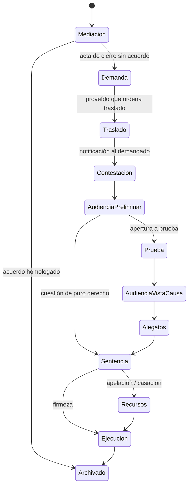

# 02 — Área Expedientes

## 1. Descripción

Es el núcleo del sistema. Cada expediente reúne todo lo que el abogado necesita saber y hacer sobre una causa: ficha identificatoria, partes, **tipo de proceso con sus etapas**, la **historia del expediente** (todo lo que pasó, en una sola línea de tiempo), escritos redactados en la app, documentos, vencimientos, tareas, gastos, checklists de trámites y los **agentes seleccionados** para trabajar en esa causa.

El objetivo es que al abrir un expediente el abogado responda en segundos tres preguntas: **¿en qué estado está?**, **¿qué vence y cuándo?**, **¿qué tengo que hacer ahora?** Y que cualquier agente que él seleccione pueda responderlas también, apoyándose solo en la historia de ese expediente y en las fuentes que el abogado le dio.

Principio rector de esta área: **el abogado configura**. Las tipos de proceso, sus etapas, los plazos típicos y los agentes disponibles son configuración suya. El sistema trae ejemplos iniciales editables, nunca reglas fijas.

## 2. Desarrollo

### 2.1 Alta y configuración del expediente

Al crear un expediente el abogado elige el **tipo de proceso** (ordinario, sumario, expropiación, el que sea) de su catálogo de Configuración, y con eso el expediente queda posicionado en la **primera etapa** de ese tipo. El tipo de proceso define cómo se comporta el expediente de ahí en adelante. Solo se ofrecen los tipos **activos**; si no hay ninguno configurado, el alta remite a Configuración antes de seguir.

La **carátula** se escribe o se pega como venga del Portal del SAE: el sistema la parte en actor, demandado y objeto, la normaliza y muestra en vivo cómo va a quedar guardada (`10-normalizacion-de-texto.md`).

**Ficha**

| Campo | Detalle |
|---|---|
| Número y año | Formato del SAE (por ejemplo `1234/26`). Único por juzgado. |
| Carátula | "Actor c/ Demandado s/ Objeto". Se escribe o se pega en cualquier variante; el sistema la normaliza y guarda sus tres componentes por separado. |
| Centro judicial | Capital, Concepción, Monteros. |
| Fuero | Civil y Comercial Común, Civil en Documentos y Locaciones, Cobros y Apremios, Familia y Sucesiones, Paz **[a confirmar denominaciones actuales]**. |
| Juzgado | Tipo de juzgado y nominación ("Civil y Comercial Común VI"). Hoy son dos campos libres con sugerencias; cuando exista el catálogo de juzgados de Configuración pasan a ser una referencia, con la secretaría. |
| Oficina de Gestión Asociada | OGA que atiende al juzgado. Campo libre que sugiere las que ya se usaron; con el catálogo de juzgados la trae el juzgado elegido. |
| Clase | Principal o incidente. Define el plazo de caducidad de instancia (§2.11). |
| Último movimiento | Fecha del último movimiento útil, de la que se cuenta la caducidad. Hoy se carga a mano; cuando exista la historia del expediente la escribe la última entrada. |
| Caducidad declarada | Fecha en que el juzgado declaró la caducidad de instancia, si la declaró. |
| Audiencia fijada | Tipo, fecha y hora de la audiencia que fijó el juzgado. Sin fecha no hay audiencia fijada. Pasa a la agenda cuando exista. |
| **Tipo de proceso** | Elegido del catálogo del abogado (ver abajo). Define etapas, plazos típicos, escritos típicos, guías y agentes sugeridos. |
| Materia | Especialidad principal de la causa: daños y perjuicios, consumidor, contratos, prescripción, locaciones, sucesiones, ejecuciones, otra. Editable por el abogado. Sirve para sugerir agentes por especialidad. |
| Rol del cliente | Actor, demandado, tercero, heredero, acreedor, otro. |
| Estado | En mediación, en trámite, suspendido, con sentencia, en ejecución, archivado, paralizado. |
| Etapa actual | Etapa del tipo de proceso en la que está el expediente. |
| Monto | Monto reclamado o base regulatoria, con moneda y fecha. |
| Fechas clave | Inicio de mediación, inicio de demanda, radicación, sentencia, firmeza. |
| Notas y etiquetas | Texto libre y etiquetas para agrupar. |

**Tipos de proceso (Configuración → Tipos de proceso)**

Un tipo de proceso es una configuración del abogado con:

- Nombre y descripción.
- Lista ordenada de **etapas**; hoy, nombre y orden (se escriben una por línea y la clave se genera del nombre). Las transiciones válidas, plazos típicos (del catálogo de plazos), escritos típicos, guías y checklist por etapa se agregan cuando existan esos catálogos.
- Materias en las que suele usarse, que sirven para sugerir agentes.
- Marca de **activo**: solo los activos se ofrecen al dar de alta un expediente.

Catálogo inicial (ejemplos editables, con nombres a confirmar contra la Ley 9531): conocimiento ordinario, conocimiento sumarísimo, sumario, ejecutivo, monitorio, expropiación, sucesorio, desalojo y **personalizado** (el abogado arma las etapas desde cero). La denominación "sumario" del código anterior no existe como tal en la Ley 9531 **[a confirmar]**: se incluye como ejemplo porque el estudio la usa, y como cualquier otro se puede editar o borrar.

Los tipos de proceso se crean, editan, desactivan y borran desde Configuración. Reglas de integridad:

- Cambiar un tipo de proceso **no altera los expedientes ya creados**; el abogado puede "reaplicarlo" a un expediente si lo desea (pendiente).
- Un tipo **en uso por algún expediente no se puede borrar**: se desactiva, así deja de aparecer en las altas nuevas sin dejar expedientes sin etapas. El sistema lo informa con la cantidad de expedientes que lo usan.
- Al borrar un tipo libre, se quita de los agentes que lo tenían asignado.

### 2.2 Etapas procesales como máquina de estados

Cada plantilla define una secuencia de etapas. El sistema guarda la etapa actual y el historial de transiciones (fecha, quién la cambió, entrada de la historia que la motivó). La etapa actual condiciona qué guías, plazos, escritos y agentes se sugieren.

Ejemplo de tipo de proceso para **conocimiento ordinario** (nombres a confirmar contra el texto vigente de la Ley 9531):

Las etapas no son bloqueantes: el abogado puede cambiar la etapa libremente. La máquina de estados sugiere el siguiente paso, ordena las guías y da contexto a los agentes. Si una transición no está prevista en el tipo de proceso, el sistema la permite con una advertencia.

### 2.3 Historia del expediente

Es la **línea de tiempo única** del expediente y la fuente principal de comprensión de los agentes. Reúne, en orden cronológico, todo lo que ocurre:

| Tipo de entrada | Origen | Ejemplos |
|---|---|---|
| Actuación del juzgado | SAE (extensión o robot), carga manual | Proveído, cédula, resolución, sentencia, audiencia fijada |
| Escrito propio | Abogado (editor de la app o Word importado) | Demanda, contestación, ofrecimiento de prueba; con versiones y estado borrador / presentado |
| Escrito de la contraria | SAE o carga manual | Contestación, recurso, incidente |
| Documento | Abogado | Pericia, prueba documental, poder, comprobante |
| Evento | Agenda | Audiencia, mediación, reunión con cliente |
| Nota | Abogado | Observaciones, llamadas, acuerdos verbales |
| Cambio de etapa | Abogado o IA aprobada | "Pasa a Prueba" |
| Informe de agente | Agente seleccionado | Informe de estado, análisis de una actuación |
| Conversación fijada | Abogado | Un chat con un agente que vale la pena conservar |

Cada entrada tiene: fecha, tipo, **origen** (juzgado / abogado / IA aprobada / SAE), texto (indexado para búsqueda y RAG), adjuntos, fecha de notificación si aplica, y **efectos** (vencimientos y tareas que generó). Se puede filtrar por tipo y origen, y ver solo "lo que hizo el juzgado" o solo "lo que presenté".

Las entradas de origen IA se muestran siempre con una marca visible y con la referencia al agente y a la aprobación del abogado.

### 2.4 Incorporación de actuaciones del juzgado

El Poder Judicial de Tucumán no ofrece API. El diseño completo está en `09-conector-sae.md`. Resumen de las vías, en orden de prioridad:

1. **Extensión de navegador (MVP)**: con el abogado logueado en el Portal del SAE, la extensión lee la bandeja de notificaciones y la historia de los expedientes seguidos y las envía al sistema. No guarda credenciales.
2. **Robot en servidor (opcional, fase posterior)**: el sistema ingresa solo al Portal con las credenciales cifradas del abogado, bajo activación explícita y responsabilidad suya.
3. **Carga manual asistida (siempre disponible)**: pegar texto o subir PDF/imagen; la IA clasifica, resume y propone plazos.

Reglas comunes:

- **Deduplicación**: cada actuación importada se identifica por un hash de (expediente, fecha, tipo, texto); si ya existe, se ignora.
- **Vinculación automática** al expediente por número, año y juzgado. Si no existe, el sistema propone crearlo con la carátula y el juzgado detectados.
- Toda actuación importada entra en la historia con origen SAE y dispara el análisis del agente (Flujo 0 en `05-integracion-expedientes-ia.md`).

### 2.5 Redacción de escritos en el expediente

El abogado redacta sus escritos **dentro del expediente**, con asistencia de IA, y cada versión queda en la historia.

**Editor propio**

- Editor de texto enriquecido con encabezado de escrito precargado (juzgado, carátula, número, partes, domicilio electrónico del abogado).
- Panel lateral de IA (el Redactor u otro agente seleccionado) con acciones: generar borrador desde una plantilla de escrito y los datos del expediente, completar campos, reescribir un párrafo, revisar requisitos del escrito según la etapa y la plantilla, calcular el plazo de presentación.
- Todo lo que la IA toma de la historia lleva referencia; lo que no encuentra se marca `[[COMPLETAR: ...]]` y nunca se inventa.
- Versiones: cada guardado crea una versión; se pueden comparar y restaurar.

**Word**

- Importar `.docx` como nueva versión de un escrito (se extrae el texto para la historia y el RAG).
- Exportar cualquier versión a `.docx` o PDF para presentarla en el Portal del SAE.

**Presentación**

- Al marcar una versión como "presentado" (con fecha), se crea la entrada correspondiente en la historia y se cierra el vencimiento asociado si lo había.
- El escrito presentado queda como fuente para los agentes.

### 2.6 Agentes en el expediente

Los agentes se crean y configuran en Configuración → Agentes (`03-ia-agentes.md`). En el expediente, el abogado **selecciona cuáles trabajan en esa causa** desde el panel "Agentes". Por ejemplo: Procesalista Tucumán + Especialista en Daños y Perjuicios.

Cada agente seleccionado opera en **dominio cerrado**: solo ve la historia de este expediente y las fuentes que el abogado le asignó al configurarlo. Ofrece:

- **Informe de estado** (bajo demanda; en v2 también al llegar una notificación): estado actual, qué quedó pendiente, plazos corriendo / vencidos / próximos, advertencias, propuestas. Cada punto con su fuente (entrada de la historia, norma cargada, guía). Se guarda en la historia.
- **Chat con contexto** del expediente.
- **Análisis de una actuación** concreta (qué significa, qué plazo abre, qué conviene hacer).
- **Acciones propuestas** que quedan pendientes de aprobación (crear vencimiento, tarea, cambiar etapa, generar escrito).

El sistema sugiere agentes según la materia del expediente y la etapa actual, pero la selección es del abogado.

### 2.7 Vista "estado del expediente"

Cabecera fija de la ficha con:

- Tipo de proceso y etapa actual, con fecha desde la que está en esa etapa.
- Última entrada de la historia (fecha y resumen) y última sincronización con el SAE.
- Próximo vencimiento con días hábiles restantes.
- Tareas abiertas y checklist de trámite pendiente.
- **Sugerencias de la IA** pendientes de aprobación y último informe de estado.
- Acciones rápidas: registrar actuación, subir documento, redactar escrito, calcular plazo, pedir informe de estado, preguntar a un agente.

### 2.8 Búsqueda

**Buscador del listado (hecho).** Un solo campo que encuentra el expediente por número o por parte, escribiendo como resulte más cómodo:

- **Por número**, entero o parcial: "1234", "123" o "1234/26" llegan al 1234/26.
- **Por parte**: actor o demandado, y también objeto y materia.
- **Sin tildes ni mayúsculas**: "nicolas" encuentra a "Nicolás", "danos" encuentra "Daños". La consulta y el dato se reducen los dos a una forma comparable (`normalizarParaBuscar`, `10-normalizacion-de-texto.md`), así que da igual cómo se escriba de los dos lados.
- **Por palabras, en cualquier orden**: "juan perez" encuentra "Pérez, Juan"; se exige que todas las palabras estén en el mismo expediente.
- **Por juzgado y por OGA**: el juzgado con su nominación y la Oficina de Gestión Asociada también entran en la búsqueda, además de tener su propio filtro.
- **Filtra en la misma tecla**: el filtrado corre en el cliente sobre la lista ya cargada, sin ida y vuelta al servidor. La consulta y los filtros se reflejan en la URL (`?q=`, `?estado=`, `?materia=`, `?fuero=`, `?juzgado=`, `?oga=`) para poder compartir o volver a una vista, y un enlace con esos parámetros abre el listado ya filtrado.

**Filtros del listado (hecho).** Cinco desplegables junto al buscador —**juzgado**, **OGA**, **estado**, **materia** y **fuero**— que se combinan entre sí y con la búsqueda. Solo ofrecen los valores que existen en los expedientes cargados, con la cantidad de cada uno: un desplegable con los siete estados posibles cuando el estudio usa dos invita a elegir combinaciones que no devuelven nada. Cuando hay algo filtrado aparecen el conteo ("3 de 12") y un botón para limpiar.

El filtro por juzgado compara el juzgado **con su nominación**: la VI y la IV del mismo fuero son dos juzgados distintos y no se mezclan. Mientras no exista el catálogo de juzgados de Configuración, los valores salen de lo que se cargó en los expedientes, así que dos formas de escribir el mismo juzgado son dos entradas del desplegable; la normalización del texto al guardar es lo que evita que eso pase seguido.

Pendiente:

- Filtrar también por etiqueta cuando existan las etiquetas.
- Texto completo dentro de la historia de un expediente o de todo el estudio.
- Búsqueda semántica (mismo índice que usa el RAG) para preguntas del tipo "¿en qué expedientes se discutió la prescripción bienal?".

### 2.9 Listado y tablero

**Hecho.** Un cuadro por expediente —la burbuja que el abogado lee antes de entrar—, separados entre sí, sobre una **rejilla de dos columnas y tres filas**: lo que describe la causa a la izquierda, lo que describe su estado a la derecha, y cada fila enfrentada con la que le corresponde.

| | Izquierda: de qué expediente se trata | Derecha: situación procesal (§2.11) |
|---|---|---|
| 1 | Número en versalitas | |
| 2 | **Carátula** con su estructura visible: las partes en negrita, los conectores "c/" y "s/" en itálica apagada, el objeto en tono más liviano. Las dos partes se muestran igual: el rol del cliente se consulta en la ficha | **Semáforo** con su color: en trámite, para caducidad, caduco |
| 3 | **Dónde tramita**: juzgado con su nominación, Oficina de Gestión Asociada y centro judicial, y a continuación la **audiencia fijada** con su tipo, fecha y hora si hay una | **Etapa** en que quedó el expediente |

Es una rejilla y no dos columnas sueltas porque las filas tienen que quedar enfrentadas: el semáforo a la altura de la carátula y la etapa a la del juzgado, sin depender de que los dos bloques midan lo mismo. La tercera fila arranca separada de la carátula, para que la identidad de la causa se lea como un bloque y el trámite como otro.

**El detalle del movimiento no va en la burbuja**: en el listado alcanza el color, y de dónde sale ese color —"sin movimiento desde el 11/05/2026", "faltan 6 días para la caducidad", "caducidad declarada el 12/06/2026"— aparece al pasar el mouse por el semáforo y explicado en la ficha. Así el único elemento que compite por atención en cada burbuja es el que avisa.

**No se muestran** la materia ni el tipo de proceso: el tipo ya surge de la carátula y la materia es un dato de la ficha, donde sirve para sugerir agentes. Ese lugar lo ocupa lo que el abogado necesita para decidir si tiene que actuar hoy.

Una audiencia cuya fecha ya pasó no se muestra en la burbuja —no es una audiencia fijada— pero sí en la ficha, marcada como pasada: la burbuja es para lo que queda por hacer.

En pantalla angosta las dos columnas se apilan en el orden de la rejilla. Encabezado propio del área, fijo al hacer scroll, con el buscador, los filtros y la acción de alta.

Este dibujo dejó de ser propio del área: vive en `components/Registro.tsx` y lo usan también las listas de tipos de proceso y de agentes, con la misma regla de color y de hover (`07-arquitectura.md` §3.6).

Pendiente:

- Listado con columnas configurables: carátula, juzgado, tipo de proceso, etapa, materia, próximo vencimiento, última entrada, estado, última sincronización.
- Filtros guardados ("con vencimiento esta semana", "en prueba", "para caducidad", "sin sincronizar hace 3 días").
- Que el último movimiento lo escriba la historia del expediente en lugar de cargarse a mano.

### 2.10 Configuración a cargo del abogado

Área "Configuración" con estas secciones:

| Sección | Estado |
|---|---|
| **Estudio**: datos del abogado (nombre, matrícula, CUIT, domicilio electrónico) y preferencias (centro judicial habitual, modelo por defecto, corrección de tildes) | hecho |
| **Tipos de proceso** y sus etapas | hecho |
| **Agentes** especializados (`03-ia-agentes.md`) | hecho |
| Catálogo de plazos por acto (compartido con Agenda) | pendiente |
| Plantillas de escritos | pendiente |
| Materias / especialidades (hoy se escriben libremente y se sugieren las ya usadas) | pendiente |
| Juzgados y secretarías | pendiente |
| Dispositivos SAE (`09-conector-sae.md`) | pendiente |

Todo lo anterior viene con ejemplos iniciales que el abogado puede editar o borrar.

### 2.11 Caducidad de instancia

**Hecho.** Es la primera regla de derecho procesal que el sistema aplica sobre el expediente, y la que contesta la pregunta del listado: *¿este expediente se está cayendo?*

| Situación | Color | Cuándo |
|---|---|---|
| **En trámite** | verde | Hay instancia en curso y el expediente se movió dentro del plazo. |
| **Para caducidad** | amarillo | Se cumplieron los meses sin movimiento: **seis** en el principal, **tres** en los incidentes **[a confirmar contra el texto vigente de la Ley 9531]**. También el expediente que el abogado marcó como paralizado, aunque las fechas no lleguen al plazo: esa marca es suya. |
| **Caduco** | rojo | El juzgado declaró la caducidad. |
| El estado cargado | gris | No hay instancia en curso que pueda caducar: en mediación previa, suspendido, con sentencia, en ejecución o archivado. |

Reglas del cómputo (`src/lib/procesal/caducidad.ts`, con tests):

- **La situación no se guarda: se deduce.** Lo que se guarda son hechos —la fecha del último movimiento y, si ocurrió, la fecha en que el juzgado declaró la caducidad—. Un estado derivado que se persiste queda viejo solo con que pase el tiempo.
- El plazo corre por **meses corridos**, no por días hábiles, así que no interviene el calendario de feriados. Si el día no existe en el mes de destino se usa el último de ese mes (31/03 + 6 meses = 30/09), como manda el artículo 6 del Código Civil y Comercial.
- El orden de las reglas es el del derecho: la caducidad declarada tapa todo lo demás; después se ve si hay instancia en curso; solo entonces se cuentan los meses.
- Si el expediente no tiene fecha de último movimiento —los que se cargaron antes de que existiera el campo—, se usa la fecha desde la que está en la etapa actual, y en última instancia la de carga.
- Faltando treinta días o menos, el detalle avisa cuántos quedan aunque el semáforo siga en verde.
- El día de hoy entra como dato desde el servidor y no se lee del reloj en cada fila: el semáforo tiene que dar lo mismo en el HTML inicial y después de la hidratación, y los tests necesitan fijarlo.

Dónde se ve: en el **listado**, el color del semáforo, con el detalle al pasar el mouse (§2.9); en la **ficha**, el semáforo y el cómputo escrito —de qué fecha se cuenta, cuándo se cumple el plazo y cuántos días faltan—, que es lo que el abogado necesita para decidir si impulsa el expediente hoy.

Pendiente: que los plazos sean configurables junto con el catálogo de plazos, que el último movimiento lo escriba la historia del expediente, y que un expediente para caducidad genere una tarea en Agenda en lugar de esperar a que el abogado lo vea en el listado.

## 3. Funcionalidad

### MVP

- [x] Alta, edición y baja de expedientes, eligiendo el tipo de proceso en el alta.
- [x] Carátula normalizada, con sus componentes guardados por separado (`10-normalizacion-de-texto.md`).
- [ ] Baja lógica y archivo de expedientes (hoy la baja es definitiva).
- [ ] Ficha completa: partes, montos, fechas clave, etiquetas.
- [x] Tipos de proceso configurables (crear, editar, desactivar, borrar) con ejemplos iniciales para ordinario, sumarísimo, sumario, ejecutivo, monitorio, expropiación, sucesorio y desalojo.
- [ ] Etapas con historial de transiciones y advertencia en transiciones no previstas (hoy se guarda la etapa actual y desde cuándo).
- [ ] Historia unificada con todos los tipos de entrada, filtros por tipo y origen, indexación para RAG.
- [ ] Carga manual asistida de actuaciones (texto o PDF) e ingestión desde la extensión del SAE con deduplicación y vinculación automática.
- [ ] Editor de escritos con panel de IA, versiones, importación y exportación Word/PDF, marcado de "presentado".
- [ ] Documentos con subida, extracción de texto y clasificación propuesta.
- [ ] Panel de agentes seleccionados por expediente e informe de estado bajo demanda (hoy la ficha sugiere agentes por materia y tipo de proceso).
- [ ] Vencimientos y tareas generados desde la historia, visibles en Agenda.
- [x] Buscador del listado por número y por partes, sin tildes ni mayúsculas.
- [x] Filtros por juzgado, OGA, estado, materia y fuero, combinables y reflejados en la URL.
- [x] Semáforo de caducidad de instancia en el listado y en la ficha (§2.11).
- [ ] Vista "estado del expediente" y filtros guardados (hoy hay listado con buscador, filtros y ficha básica).

### v2

- [ ] Robot de sincronización con el SAE (opt-in).
- [ ] Informe de estado automático al llegar una notificación.
- [ ] Tipos de proceso para incidentes y cautelares; tipos de proceso y agentes compartibles entre usuarios.
- [ ] Comparación visual entre versiones de escritos.
- [ ] Reportes: expedientes por etapa, por juzgado, antigüedad, productividad.
- [ ] Portal de clientes de solo lectura.
- [ ] Multiusuario con asignación de expedientes.
