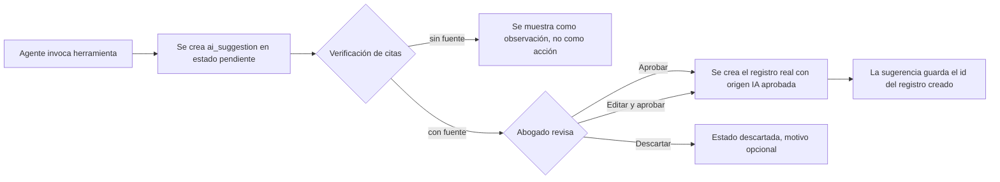
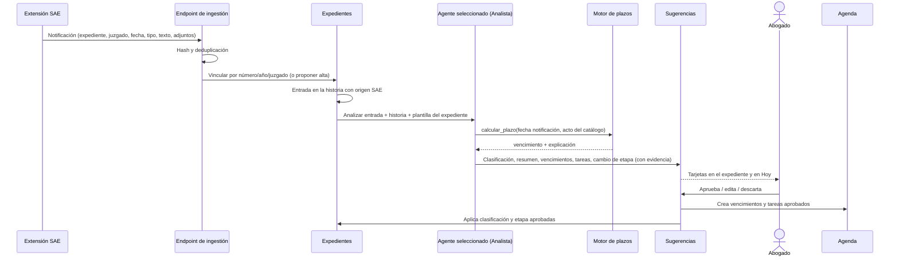
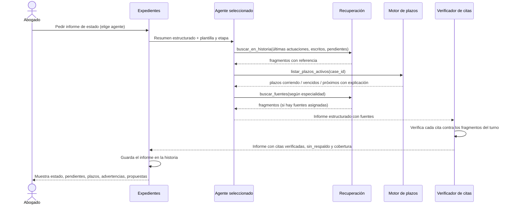

# 05 — Integración Expedientes e IA

## 1. Por qué este documento

La función principal del sistema es **asistir al abogado durante la tramitación**. Eso ocurre en el cruce entre el área Expedientes (qué pasa en la causa, registrado en su historia) y el área IA (qué significa y qué conviene hacer, según los agentes que el abogado seleccionó). Este documento define los flujos concretos, el patrón de aprobación que los gobierna y las herramientas que los agentes pueden invocar.

Todo lo que sigue respeta el dominio cerrado (`03-ia-agentes.md`, sección 2.7): los agentes solo ven la historia del expediente y las fuentes asignadas; los plazos los calcula el motor; nada se escribe sin aprobación.

## 2. Patrón general: propuesta y aprobación

Ningún agente escribe directamente en la historia, en Agenda ni en Documentos. Toda acción pasa por la tabla `ai_suggestions`:



Cada sugerencia guarda: agente y versión, conversación y mensaje de origen, expediente, tipo de acción, datos propuestos, **evidencia** (fragmento de la historia o de una fuente que la justifica), estado y resolución.

Las sugerencias pendientes se ven en tres lugares: dentro de la respuesta del chat, en la cabecera del expediente y en la vista Hoy de la Agenda.

## 3. Flujos

### Flujo 0: notificación del SAE, historia, análisis, plazos

Disparador: la extensión de navegador (o el robot, o una carga manual) envía una notificación del Portal del SAE. Detalle del conector en `09-conector-sae.md`.



Si el expediente no tiene ningún agente seleccionado, la entrada igual se guarda en la historia y el sistema ofrece "analizar con…" para elegir uno.

### Flujo 1: actuación cargada a mano, análisis, vencimientos y tareas

Igual al Flujo 0 desde la entrada en la historia, con origen "carga manual". El abogado pega el texto o sube el PDF; el sistema extrae el texto y sigue el mismo camino.

### Flujo 2: etapa procesal y asistente de trámite

Disparador: cambia la etapa del expediente (manual o por aprobación de una sugerencia).

1. El sistema lee la etapa en la plantilla de proceso del expediente: guías sugeridas, checklist, plazos típicos, escritos típicos, agentes sugeridos.
2. En la ficha aparece el bloque **"En esta etapa"** con esos elementos.
3. Si el abogado activa el checklist, los ítems se convierten en tareas con plazos relativos calculados por el motor.
4. "Preguntar" abre un chat con el agente sugerido, con el expediente y la guía como contexto. Si el agente sugerido no está seleccionado en el expediente, se ofrece seleccionarlo.

### Flujo 3: redacción de un escrito en el expediente

Disparador: el abogado abre el editor de escritos del expediente (nuevo escrito, o desde un escrito típico de la etapa) o importa un `.docx`.

```mermaid
sequenceDiagram
    actor Abogado
    participant ED as Editor del expediente
    participant RED as Agente seleccionado (Redactor)
    participant RAG as Recuperación
    participant DOC as Documentos / Historia

    Abogado->>ED: Nuevo escrito "contestación de demanda"
    ED->>RED: Generar borrador (plantilla de escrito + expediente)
    RED->>RAG: buscar_en_historia(demanda, documental, hechos)
    RAG-->>RED: fragmentos con referencia
    RED->>RAG: buscar_fuentes(contestación, normas asignadas)
    RAG-->>RED: artículos aplicables (si están cargados)
    RED-->>ED: Borrador con referencias y marcas COMPLETAR
    Abogado->>ED: Edita; pide reescribir párrafos, completar, revisar requisitos
    ED->>DOC: Guarda versiones
    Abogado->>DOC: Exporta a Word/PDF y presenta en el SAE
    Abogado->>DOC: Marca "presentado" con fecha
    DOC->>DOC: Entrada en la historia; cierra vencimiento asociado
```

Reglas:

- Lo tomado de la historia lleva referencia; lo que falta se marca `[[COMPLETAR]]`.
- Cada versión conserva el prompt y los fragmentos usados.
- Importar un `.docx` crea una versión nueva y extrae su texto para la historia.

### Flujo 4: consulta con memoria del expediente

Disparador: chat con un agente seleccionado en el expediente.

- El agente recibe un **resumen estructurado** del expediente en cada turno: carátula, juzgado, plantilla y etapa, materia, partes, últimas cinco entradas de la historia, vencimientos abiertos, tareas abiertas.
- Para detalle, `buscar_en_historia` recupera fragmentos filtrados por `case_id`.
- Preguntas típicas: "¿qué prueba ofreció la contraria?", "¿cuándo se notificó la sentencia?", "resumime el expediente para una reunión con el cliente".
- Las conversaciones quedan asociadas al expediente y pueden fijarse como entrada de la historia.

### Flujo 5: panel del expediente con sugerencias

Disparador: apertura de la ficha.

- Sección **"Sugerencias de la IA"** con las pendientes, ordenadas por urgencia.
- Cada tarjeta: qué se propone, evidencia, agente y fecha, botones Aprobar / Editar / Descartar.
- Observaciones sin fuente se listan aparte, sin botones de acción.

### Flujo 6: informe de estado por agente seleccionado

Disparador: el abogado pide "Informe de estado" a un agente seleccionado (v2: también al llegar una notificación del SAE y en una revisión diaria).



Las propuestas del informe son sugerencias comunes (Flujo 5). El informe se compara con el anterior para resaltar qué cambió.

## 4. Herramientas que exponen los agentes

Todas las herramientas de escritura crean **propuestas**, no registros definitivos. Las de lectura respetan el filtro por agente y expediente.

| Herramienta | Tipo | Entrada | Salida | Agentes típicos |
|---|---|---|---|---|
| `calcular_plazo` | lectura | fecha base, acto del catálogo, centro judicial | vencimiento, gracia, explicación | Procesalista, Analista, Redactor |
| `listar_plazos_activos` | lectura | `case_id` | plazos corriendo, vencidos y próximos con explicación | Analista, Procesalista |
| `buscar_en_historia` | lectura | consulta, `case_id`, filtros (tipo, origen, fechas) | fragmentos con referencia | Todos |
| `buscar_fuentes` | lectura | consulta, capa (normativa / guías / corpus propio) | fragmentos con referencia, solo de fuentes asignadas | Todos |
| `resumen_expediente` | lectura | `case_id` | resumen estructurado | Analista, Redactor |
| `sugerir_guia` | lectura | `case_id`, etapa | guías y checklists de la plantilla | Procesalista, Analista |
| `informe_estado` | propuesta | `case_id` | informe estructurado guardado en la historia; propuestas como sugerencias | Analista, especialistas |
| `clasificar_actuacion` | propuesta | `entry_id`, tipo, resumen | sugerencia | Analista |
| `crear_vencimiento` | propuesta | `case_id`, acto, fecha base, resultado del motor, evidencia | sugerencia | Procesalista, Analista |
| `crear_tarea` | propuesta | `case_id`, título, plazo relativo, evidencia | sugerencia | Analista, Procesalista |
| `cambiar_etapa` | propuesta | `case_id`, etapa destino, evidencia | sugerencia | Analista |
| `generar_escrito` | propuesta | `case_id`, plantilla de escrito, contenido, fragmentos usados | sugerencia; al aprobarse, versión en el editor | Redactor |
| `vincular_expediente_sae` | propuesta | datos detectados (número, año, juzgado, carátula) | sugerencia de alta o de vinculación | Ingestión |
| `buscar_jurisprudencia` (v2) | lectura | consulta, dominios permitidos | fallos con enlace | Investigador |

## 5. Contexto que recibe cada agente

1. **Siempre**: instrucciones del agente (incluidas las reglas de dominio cerrado y las guías de comportamiento del abogado) + resumen estructurado del expediente.
2. **Bajo demanda**: fragmentos recuperados por las herramientas, con límite por turno, y solo de fuentes asignadas y de la historia del expediente.
3. **Nunca**: documentos completos, fuentes no asignadas, historia de otros expedientes, conocimiento general (salvo modo opt-in con aviso).

## 6. Verificación de citas y cobertura

- Cada turno registra los fragmentos recuperados.
- La respuesta se analiza antes de mostrarse: toda cita debe corresponder a un fragmento del turno. Las que no coinciden se marcan "cita no verificada" o se eliminan según configuración.
- Se calcula la cobertura (proporción de afirmaciones con cita verificada) y se lista lo que quedó sin respaldo.
- Propuestas sin cita verificada se degradan a observación.

## 7. Casos límite y decisiones

- **Actuación ambigua**: el Analista propone la clasificación con confianza baja y pide confirmación en vez de proponer un vencimiento.
- **Fecha de notificación desconocida**: la sugerencia de vencimiento se crea sin fecha y con la tarea "confirmar fecha de notificación en el SAE".
- **Acto no catalogado**: el agente no calcula; propone agregar el acto al catálogo del abogado.
- **Conflicto de etapa**: si la etapa propuesta no es una transición prevista en la plantilla, se muestra con advertencia.
- **Expediente sin agentes seleccionados**: las entradas se guardan igual; se ofrece seleccionar un agente para analizar.
- **Expediente sin fuentes asignadas al agente**: el agente trabaja solo con la historia y lo dice.
- **Varios expedientes en una consulta**: solo con pedido explícito del abogado y con aviso.
