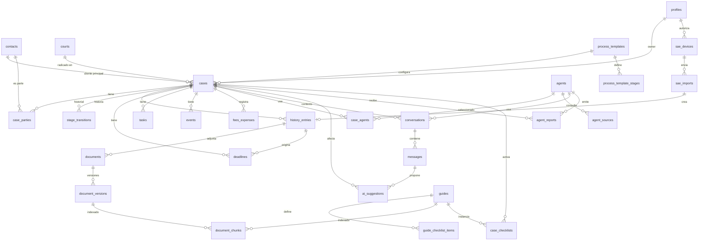

# 06 — Modelo de datos

Esquema propuesto para Postgres en Supabase. Todas las tablas de negocio llevan `owner_id` (referencia a `auth.users`) y políticas de seguridad por fila (RLS) del tipo `owner_id = auth.uid()`. Con esto el MVP es monousuario y el paso a multiusuario consiste en agregar una tabla de miembros de estudio y ampliar las políticas.

Convenciones: claves `uuid`, `created_at` y `updated_at` en todas las tablas, baja lógica con `deleted_at` donde tenga sentido (expedientes, documentos, contactos, agentes, plantillas).

Principio: las tablas de **configuración** (plantillas de proceso, catálogo de plazos, plantillas de escritos, agentes, materias) pertenecen al abogado. Las filas de ejemplo que trae el sistema se copian a su `owner_id` al inicializar, para que pueda editarlas o borrarlas.

## 1. Diagrama de entidades

## 2. Tablas

### Identidad y contactos

**profiles**: extensión de `auth.users`.
`id`, `nombre`, `matricula`, `cuit`, `domicilio_electronico`, `telefono`, `preferencias jsonb` (recordatorios, modelo por defecto, centro judicial habitual, política de citas no verificadas).

**contacts**: personas y organismos.
`id`, `owner_id`, `tipo` (cliente | contraparte | letrado | perito | juzgado | mediador | escribano | otro), `nombre`, `documento`, `domicilio_real`, `domicilio_electronico`, `telefono`, `email`, `notas`, `es_cliente bool`, `datos_facturacion jsonb`, `deleted_at`.

**courts**: juzgados y secretarías.
`id`, `owner_id`, `centro_judicial` (capital | concepcion | monteros), `fuero`, `nominacion`, `secretaria`, `direccion`, `telefono`, `horario_mesa`, `juez`, `secretario`, `nombre_sae` (como aparece en el Portal, para vinculación).

### Configuración del abogado

**process_templates**: plantillas de proceso.
`id`, `owner_id`, `nombre`, `tipo_proceso`, `descripcion`, `materias text[]`, `activa bool`, `origen` (ejemplo | propia), `deleted_at`.

**process_template_stages**: etapas de cada plantilla.
`id`, `template_id`, `clave`, `nombre`, `orden`, `transiciones text[]` (claves de etapas siguientes), `deadline_type_ids uuid[]` (plazos típicos), `writing_template_ids uuid[]` (escritos típicos), `guide_ids uuid[]`, `agent_ids uuid[]` (agentes sugeridos), `checklist jsonb`.

**deadline_types**: catálogo de plazos por acto.
`id`, `owner_id`, `nombre`, `dias`, `tipo_dias` (habiles | corridos), `aplica_gracia bool`, `articulo`, `tipo_proceso text[]`, `verificado bool`, `origen` (ejemplo | propia).

**writing_templates**: plantillas de escritos.
`id`, `owner_id`, `nombre`, `tipo_escrito`, `cuerpo_html`, `variables jsonb`, `origen` (ejemplo | propia), `deleted_at`.

**subject_matters**: materias / especialidades.
`id`, `owner_id`, `clave`, `nombre`, `rama`.

**holidays**
`id`, `owner_id` (null para semilla compartida), `fecha`, `nombre`, `alcance` (nacional | provincial | centro_judicial), `centro_judicial` (null), `tipo` (feriado | feria | asueto | duelo), `fuente`.

### Expedientes

**cases**
`id`, `owner_id`, `numero`, `anio`, `caratula`, `court_id`, `centro_judicial`, `fuero`, `process_template_id`, `materia`, `rol_cliente`, `client_id`, `estado`, `etapa_actual` (clave de `process_template_stages`), `etapa_desde`, `monto numeric`, `moneda`, `monto_fecha`, `fecha_inicio_mediacion`, `fecha_demanda`, `fecha_sentencia`, `fecha_firmeza`, `etiquetas text[]`, `notas`, `ultima_entrada_at`, `ultima_sync_sae_at`, `seguido_en_sae bool`, `deleted_at`.
Índice único `(owner_id, court_id, numero, anio)`.

**case_parties**
`id`, `case_id`, `contact_id`, `rol` (actor | demandado | tercero | citado_garantia | sindico | perito | letrado_contraria | mediador | otro), `representa_a` (contact_id, null), `notas`.

**stage_transitions**
`id`, `case_id`, `etapa_desde`, `etapa_hasta`, `fecha`, `origen` (manual | ia_aprobada), `history_entry_id` (null), `ai_suggestion_id` (null), `prevista bool` (si la transición estaba en la plantilla).

**case_agents**: agentes seleccionados por expediente.
`id`, `case_id`, `agent_id`, `seleccionado_at`, `activo bool`.

### Historia del expediente

**history_entries**: línea de tiempo unificada (reemplaza a "actuaciones").
`id`, `owner_id`, `case_id`, `fecha`, `fecha_notificacion` (null), `tipo` (actuacion_juzgado | escrito_propio | escrito_contraria | documento | evento | nota | cambio_etapa | informe_agente | conversacion), `subtipo` (proveido | cedula | interlocutoria | sentencia | audiencia | pericia | oficio | informe | demanda | contestacion | otro), `origen` (juzgado | abogado | ia_aprobada | sae), `texto`, `resumen`, `clasificado_por` (abogado | ia_aprobada | null), `ref_tipo` y `ref_id` (enlace a `documents`, `events`, `agent_reports`, `conversations` o `stage_transitions` según el tipo), `sae_import_id` (null), `tsv tsvector`.

**case_notes**: notas del abogado (se reflejan como `history_entries` de tipo nota).
`id`, `case_id`, `texto`, `created_at`.

### Documentos y escritos

**documents**
`id`, `owner_id`, `case_id`, `history_entry_id` (null), `tipo` (demanda | contestacion | cedula | proveido | sentencia | pericia | prueba_documental | poder | convenio_honorarios | escrito_propio | otro), `titulo`, `es_escrito_propio bool`, `estado_escrito` (borrador | presentado | null), `presentado_at` (null), `writing_template_id` (null), `version_actual_id`, `deleted_at`.

**document_versions**
`id`, `document_id`, `numero`, `contenido_html` (null; escritos del editor), `storage_path` (null; archivos subidos o importados), `mime`, `tamanio`, `texto_extraido`, `ocr bool`, `generado_por` (abogado | ia_aprobada | importado_word), `prompt_origen jsonb` (null; mensaje y fragmentos usados), `created_at`.

**document_chunks**: índice unificado para RAG.
`id`, `owner_id`, `capa` (normativa | guia | corpus_propio | historia), `source_type` (document_version | guide | norm | history_entry | writing_template | own_corpus), `source_id`, `case_id` (null), `orden`, `contenido`, `metadatos jsonb` (artículo, sección, página), `embedding vector(1536)`, `tsv tsvector`.
Índices: HNSW sobre `embedding`, GIN sobre `tsv`, btree sobre `(owner_id, capa, case_id)`.

**norms**: corpus normativo cargado por el abogado.
`id`, `owner_id`, `nombre`, `jurisdiccion`, `version_fecha`, `fuente_url`, `texto`, `origen` (ejemplo | propia), `activa bool`.

**own_corpus**: fallos, modelos y otros textos propios.
`id`, `owner_id`, `titulo`, `tipo` (fallo | modelo | doctrina | otro), `texto`, `storage_path` (null).

### Agenda y plazos

**deadlines**
`id`, `owner_id`, `case_id`, `history_entry_id` (null), `deadline_type_id` (null), `titulo`, `fecha_base`, `regla_inicio` (parámetro aplicado de notificación digital), `fecha_vencimiento`, `fecha_gracia` (null), `explicacion jsonb`, `estado` (pendiente | cumplido | vencido | anulado), `cumplido_con` (history_entry_id, null), `origen` (manual | ia_aprobada), `ai_suggestion_id` (null).

**tasks**
`id`, `owner_id`, `case_id` (null), `titulo`, `descripcion`, `fecha_limite` (null), `prioridad`, `estado` (pendiente | en_curso | hecha | cancelada), `case_checklist_id` (null), `origen`, `ai_suggestion_id` (null).

**events**
`id`, `owner_id`, `case_id` (null), `tipo` (audiencia | mediacion | reunion | turno | otro), `titulo`, `inicio`, `fin`, `lugar`, `notas`, `recordatorios jsonb`, `external_calendar_id` (null; v2).

**time_entries** (v2)
`id`, `owner_id`, `case_id`, `task_id` (null), `inicio`, `fin`, `descripcion`.

**fees_expenses**
`id`, `owner_id`, `case_id`, `tipo` (gasto | honorario_pactado | honorario_regulado), `concepto`, `monto`, `moneda`, `fecha`, `estado`, `comprobante_document_id` (null), `instancia` (null), `comunicado_caja bool`.

### IA

**agents**
`id`, `owner_id`, `nombre`, `descripcion`, `icono`, `rol`, `rama`, `especialidades text[]`, `tipos_proceso text[]`, `instrucciones`, `bloques_prompt jsonb`, `guias_comportamiento`, `herramientas text[]`, `modo_conocimiento` (solo_fuentes | general), `web_habilitada bool`, `dominios_web text[]`, `modelo`, `parametros jsonb`, `activo bool`, `version int`, `origen` (ejemplo | propio), `deleted_at`.

**agent_sources**: fuentes asignadas explícitamente a cada agente.
`id`, `agent_id`, `capa` (normativa | guia | corpus_propio | historia_expediente), `source_type` (norm | guide_collection | guide | writing_template | own_corpus | history), `source_id` (null para "toda la colección" o "historia"), `filtro jsonb`.

**conversations**
`id`, `owner_id`, `agent_id`, `agent_version`, `case_id` (null), `titulo`, `fijada bool`, `tokens_entrada`, `tokens_salida`, `costo_estimado`, `ultimo_mensaje_at`.

**messages**
`id`, `conversation_id`, `rol` (user | assistant | tool), `contenido`, `partes jsonb`, `fragmentos_turno jsonb` (ids de chunks recuperados en el turno), `citas jsonb` (cada una con `chunk_id` y `verificada bool`), `cobertura numeric`, `sin_respaldo jsonb`, `modo_conocimiento`, `tokens`, `modelo`.

**agent_reports**: informes de estado.
`id`, `owner_id`, `case_id`, `agent_id`, `agent_version`, `conversation_id` (null), `informe jsonb` (estructura de `03-ia-agentes.md`, sección 2.3), `cobertura numeric`, `history_entry_id`, `disparador` (manual | notificacion_sae | revision_diaria), `created_at`.

**ai_suggestions**
`id`, `owner_id`, `case_id` (null), `conversation_id` (null), `message_id` (null), `agent_report_id` (null), `agent_id`, `tipo` (clasificar_actuacion | crear_vencimiento | crear_tarea | cambiar_etapa | generar_escrito | vincular_expediente_sae | crear_expediente), `payload jsonb`, `evidencia jsonb` (fragmento, `chunk_id` o `history_entry_id`, verificada), `confianza`, `es_accion bool` (false si no tiene evidencia verificada: se muestra como observación), `estado` (pendiente | aprobada | editada_aprobada | descartada), `resuelta_at`, `registro_creado_tipo`, `registro_creado_id`, `motivo_descarte`.

**ai_usage**
`owner_id`, `mes`, `tokens_entrada`, `tokens_salida`, `costo_estimado`.

### Guías

**guides**
`id`, `owner_id`, `slug`, `titulo`, `coleccion` (derecho | tramites), `rama`, `tipo_proceso text[]`, `etapa text[]`, `normativa text[]`, `centro_judicial text[]`, `cuerpo_md`, `revisado_at`, `estado` (vigente | necesita_revision | borrador), `version int`, `plantillas text[]`, `origen` (ejemplo | propia).

**guide_checklist_items**
`id`, `guide_id`, `orden`, `texto`, `plazo_relativo` (null), `documento_a_producir` (null), `agente_sugerido` (null).

**case_checklists**
`id`, `case_id`, `guide_id`, `activado_at`, `completado_at` (null).

### Conector SAE

**sae_devices**: extensiones autorizadas.
`id`, `owner_id`, `nombre`, `token_hash`, `ultimo_uso_at`, `revocado_at` (null), `version_extension`, `version_selectores`.

**sae_imports**: cada notificación o actuación recibida.
`id`, `owner_id`, `device_id` (null), `robot_run_id` (null), `origen` (extension | robot | manual), `payload_crudo jsonb`, `hash`, `expediente_detectado jsonb` (número, año, juzgado, carátula), `case_id` (null), `history_entry_id` (null), `resultado` (creada | duplicada | pendiente_vinculacion | error), `error` (null), `created_at`.
Índice único `(owner_id, hash)`.

**sae_selectors**: configuración versionada de lectura del Portal.
`id`, `version`, `config jsonb`, `activa bool`, `created_at`.

**sae_credentials** (v2, solo robot)
`owner_id`, `cuit`, `password_cifrada`, `algoritmo`, `activo bool`, `ultimo_login_ok_at`, `fallos_consecutivos int`, `apagado_por` (null).

**sae_robot_runs** (v2)
`id`, `owner_id`, `inicio`, `fin`, `resultado`, `entradas_nuevas int`, `error` (null).

## 3. Storage

- Bucket privado `case-documents` con rutas `{owner_id}/{case_id}/{document_id}/v{n}.{ext}`.
- Bucket privado `sae-attachments` para PDFs recibidos del Portal, `{owner_id}/{sae_import_id}/{archivo}`.
- Bucket privado `receipts` para comprobantes de gastos.
- Acceso siempre por URL firmada de corta duración; nunca URLs públicas.
- Política de Storage alineada con RLS: solo el `owner_id` del prefijo.

## 4. Búsqueda e índices

- Léxica: `tsvector` con configuración `spanish` en `history_entries.texto`, `document_versions.texto_extraido`, `guides.cuerpo_md` y `document_chunks.contenido`.
- Semántica: pgvector con índice HNSW sobre `document_chunks.embedding`, distancia coseno.
- Función SQL `buscar_chunks(agent_id, case_id, consulta_texto, consulta_embedding, capa, limite)` que **primero** restringe a los `source_id` de `agent_sources` del agente y a `case_id` (para la capa historia), y luego combina ambos puntajes (fusión de rangos recíprocos).
- Vista `case_timeline` sobre `history_entries` con los campos resumidos de cada referencia, para la línea de tiempo.

## 5. Semillas (ejemplos copiados al abogado)

- `holidays`: feriados nacionales y provinciales, ferias 2026–2038 (Acordada 840/26).
- `deadline_types`: catálogo inicial marcado `verificado = false`, `origen = ejemplo`.
- `process_templates` + `process_template_stages`: ordinario, sumarísimo, ejecutivo, monitorio, `origen = ejemplo`.
- `writing_templates`: escritos básicos, `origen = ejemplo`.
- `subject_matters`: consumidor, daños y perjuicios, prescripción, contratos, locaciones, sucesiones, ejecuciones.
- `courts`: juzgados civiles y comerciales de Capital, Concepción y Monteros **[a completar]**.
- `norms`: Ley 9531 y modificatorias, Ley 7844, Decreto 2960/2009, Ley 5480, Ley 6238, CCyC, Ley 24.240; `activa = false` hasta que el abogado las active.
- `agents` + `agent_sources`: Procesalista, Analista, Redactor, Daños, Consumidor; `origen = ejemplo`, con fuentes sugeridas pero sin activar.
- `guides` + `guide_checklist_items`: guías semilla, `origen = ejemplo`.
- `sae_selectors`: versión inicial.

## 6. Preparación para multiusuario

- Agregar `firms(id, nombre)` y `firm_members(firm_id, user_id, rol)`.
- Reemplazar en las políticas `owner_id = auth.uid()` por una comprobación de pertenencia al estudio, o migrar `owner_id` a `firm_id`.
- Agregar `case_assignments(case_id, user_id)`.
- Plantillas, agentes y guías pasan a ser compartibles dentro del estudio.

No requiere cambios en el resto del modelo.
