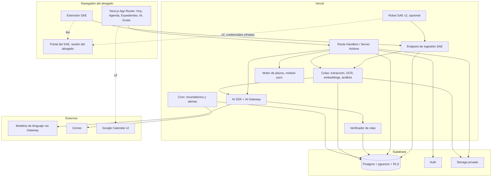

# 07 — Arquitectura

## 1. Stack

| Capa | Elección | Motivo |
|---|---|---|
| Aplicación web | **Next.js (App Router), TypeScript** | Una sola base de código para interfaz y API; renderizado en servidor para páginas con datos sensibles; despliegue directo en Vercel. |
| Hosting | **Vercel** (Fluid Compute, Node.js) | Funciones con tiempo de ejecución suficiente para procesar documentos y transmitir respuestas de IA; cron y colas nativas. |
| Base de datos | **Supabase Postgres + pgvector** | Relacional para el modelo de expedientes, vectores para RAG en la misma base, RLS para confidencialidad. |
| Autenticación | **Supabase Auth** | Correo y contraseña con segundo factor; preparado para invitar usuarios en multiusuario. |
| Archivos | **Supabase Storage** (buckets privados) | Documentos del expediente y adjuntos del SAE con URLs firmadas. |
| IA | **Vercel AI SDK v6 + AI Gateway** | Transmisión en tiempo real, llamadas a herramientas tipadas, salidas estructuradas, cambio de modelo por configuración, observabilidad y costos. |
| Editor de escritos | Editor de texto enriquecido embebible (a elegir en la fase de código) con conversión a/desde `.docx` | Redacción dentro del expediente con panel de IA; importación y exportación Word. |
| Conector SAE | **Extensión de navegador** (Chrome/Edge, Manifest V3) + endpoint de ingestión | Lectura del Portal con la sesión del abogado, sin credenciales almacenadas. |
| Robot SAE (v2, opcional) | Navegador automatizado en función de Vercel o tarea local en la PC del abogado | Sincronización sin intervención, bajo activación explícita. |
| Procesamiento asíncrono | **Vercel Queues** (o cron + tabla de trabajos si no está disponible) | Extracción de texto, OCR, embeddings y análisis de entradas nuevas fuera del ciclo de la petición. |
| Recordatorios | **Vercel Cron** | Trabajo diario a las 7 h que envía recordatorios y alertas de falta de sincronización. |
| Correo | Proveedor del Marketplace de Vercel (a elegir en la fase de código) | Recordatorios y alertas. |
| Interfaz | Tailwind CSS + componentes accesibles, íconos de **lucide-react** | Rapidez de desarrollo, tema claro/oscuro; un solo juego de íconos coherente, importados de a uno para no cargar el resto. |
| Tipografía | **IBM Plex Sans** en toda la aplicación | Una sola familia: la jerarquía se construye con peso, tamaño y color, no con familias distintas. Tiene versión variable, así que todo el rango de pesos viene en un archivo. Cubre el castellano con tildes y ñ, y se sirve autoalojada por `next/font`, sin pedidos a Google en tiempo de ejecución. |
| Sistema visual | Fondo de papel apenas cálido, superficies un tono más claras, bordes finos, un acento de azul tinta reservado a la selección y a la acción principal, y colores de estado semánticos (rojo reservado a "paralizado") | Los expedientes son el contenido; el cromo tiene que desaparecer. Definido como variables CSS en `globals.css` y expuesto a Tailwind, para cambiarlo en un solo lugar. |

## 2. Diagrama de componentes



## 3. Módulos de la aplicación

```
app/
  (auth)/            login, segundo factor
  hoy/               vista Hoy (Agenda)
  agenda/            calendario, vencimientos, contactos, honorarios
  expedientes/       listado, alta con tipo de proceso, ficha, historia, editor de escritos
    nuevo/           alta con previsualización de carátula
    [id]/            ficha
    acciones.ts      acciones de servidor del área
  ia/                conversaciones e informes (los agentes se configuran en configuracion/)
  guias/             navegación y lectura
  configuracion/     área transversal de catálogos del abogado
    estudio/         datos del abogado y preferencias
    procesos/        tipos de proceso con sus etapas
    agentes/         agentes especializados
    acciones.ts      acciones de servidor del área
  api/               route handlers (chat, ingestión SAE, colas, cron)
lib/
  plazos/            motor de plazos (puro, con tests)
  formato/           normalización de texto (puro, con tests; ver 10-normalizacion-de-texto.md)
  datos/             repositorios de configuración y expedientes; normalizan al guardar
  rag/               fragmentación, embeddings, búsqueda híbrida filtrada por agente y expediente
  agentes/           herramientas, armado de contexto, salidas estructuradas, verificación de citas, cobertura
  sae/               normalización de payloads, hash, vinculación de expedientes, selectores versionados
  editor/            modelo de documento, conversión docx, plantillas de escritos con variables
  db/                cliente Supabase, tipos generados
extension/           extensión de navegador (carpeta o repositorio aparte)
  manifest.json
  content/           lectura de bandeja e historia del Portal
  background/        envío al endpoint, estado, reintentos
  popup/             sincronizar, estado, capturar página
content/
  guias/             guías Markdown de ejemplo
  normas/            textos normativos de ejemplo
  plantillas/        tipos de proceso y de escritos de ejemplo
supabase/
  migrations/        esquema y políticas RLS
  seed/              feriados, ejemplos de configuración, agentes de ejemplo, selectores SAE
```

### 3.1 Persistencia provisoria

Hasta que esté montado Supabase, los repositorios de `lib/datos/` guardan en un archivo JSON local (`.data/estudio.json`, fuera del control de versiones), que se siembra con los ejemplos del sistema la primera vez que se lee. Es deliberadamente un reemplazo temporal:

- Todo el acceso pasa por `lib/datos/`, así que el cambio a Supabase se hace ahí y no toca páginas ni acciones.
- No hay `owner_id` todavía: es monousuario de hecho, no solo de diseño.
- Las escrituras se serializan en una cola dentro del proceso y el archivo se reemplaza de forma atómica, pero no hay protección entre procesos.
- No sirve en un despliegue serverless, donde el sistema de archivos es de solo lectura. **Montar Supabase es requisito para desplegar.**

### 3.2 Límite servidor / cliente en `lib/datos`

`lib/datos` tiene dos mitades y conviene no mezclarlas:

- **Repositorios** (`almacen`, `expedientes`, `procesos`, `agentes`, `estudio`): llegan al almacén y por lo tanto a `node:fs`. `almacen.ts` está marcado con `import "server-only"`, así que importarlos desde un componente de cliente falla con un mensaje claro en lugar de un error del empaquetador.
- **Módulos puros** (`tipos`, `filtros`): tipos, constantes, búsqueda y filtrado. Corren en los dos lados, y eso es lo que permite que el listado filtre en el cliente con exactamente las mismas reglas que usaría el servidor.

El barril `lib/datos/index.ts` reexporta todo y es **del servidor**. Los componentes de cliente importan de `lib/datos/tipos` y `lib/datos/filtros`.

### 3.3 Normalización de texto

`lib/formato/` es un módulo puro que formatea lo que se carga según qué es el dato (nombre propio, título, texto libre). Los repositorios lo aplican al guardar, de modo que cualquier vía de carga futura —el importador del SAE, una carga masiva— quede formateada igual sin repetir la regla. Detalle en `10-normalizacion-de-texto.md`.

### 3.4 Cáscara de navegación

`app/layout.tsx` monta una sola cáscara para toda la aplicación: la barra lateral (`components/Nav.tsx`) fija a la izquierda y el área de trabajo desplazándose al lado.

La barra es un **riel de íconos** de 128 px: un ícono de 32 px por área con el rótulo debajo, y Configuración anclada abajo, separada por una línea. Ocupa poco ancho porque el contenido es el expediente, pero cada área queda igualmente nombrada: no depende de que el abogado reconozca el ícono.

Reglas del riel:

- **Íconos y rótulos en el gris secundario de la aplicación** (`text-zinc-600 dark:text-zinc-400`, el mismo de las descripciones y los metadatos): se leen sin esfuerzo y no compiten con la carátula.
- **El azul de acento marca una sola cosa: el área abierta.** El ítem activo va en `text-acento` sobre `bg-acento-suave`. Al pasar el mouse aparece solo el fondo teñido, sin teñir la tinta, para que el azul no signifique dos cosas distintas.
- Un área sigue abierta desde sus subrutas: en `/expedientes/12` el ítem Expedientes queda marcado.
- El riel se apoya en su propio tono de papel, `--barra`, un paso más hondo que el fondo, para retirarse respecto del área de trabajo.
- El ítem activo lleva `aria-current="page"`, y cada ícono es `aria-hidden`: lo que anuncia el lector de pantalla es el rótulo, no el dibujo.

Dentro de un área, `components/SubNav.tsx` resuelve la navegación horizontal entre secciones; hoy solo la usa Configuración.

## 4. Motor de plazos

Módulo sin dependencias de red ni base de datos. Recibe el calendario de días inhábiles y las reglas parametrizadas como argumentos para poder testearlo con calendarios sintéticos.

```
calcularPlazo({
  fechaBase, tipoBase: 'notificacion_digital' | 'presentacion' | 'actuacion',
  dias, tipoDias: 'habiles' | 'corridos',
  aplicaGracia, centroJudicial,
  reglas: { inicioNotificacionDigital, horarioTribunales, plazoGracia },
  calendario: DiaInhabil[]
}) => {
  vencimiento, gracia?, pasos: [{ fecha, motivo }]
}
```

Reglas y casos de test mínimos:

- Notificación un viernes: el plazo empieza el lunes.
- Notificación digital: regla de inicio parametrizada **[a confirmar acordada]**.
- Presentación fuera del horario de tribunales: corre desde la primera hora del día hábil siguiente (confirmado en la ayuda del Portal).
- Plazo que atraviesa la feria de julio: se suspende y reanuda.
- Vencimiento que cae en feriado provincial: pasa al día hábil siguiente.
- Asueto de un centro judicial que no afecta a otro.
- Plazo en días corridos que termina en día inhábil.
- Plazo de gracia: se informa como fecha secundaria **[a confirmar régimen en Ley 9531]**.

Cada resultado se guarda con su lista de pasos en `deadlines.explicacion`. **Solo el motor calcula plazos**; los agentes lo invocan y reportan su salida.

## 5. Pipeline de documentos y entradas

1. Entrada nueva en la historia (desde la extensión, carga manual, editor o subida de archivo).
2. Encolado de `procesar_entrada(history_entry_id)`.
3. Extracción de texto de adjuntos: PDF con texto, directa; escaneado o imagen, OCR.
4. Fragmentación y embeddings en `document_chunks` con `capa = historia` y `case_id`.
5. Si el expediente tiene agentes seleccionados: análisis (clasificación, resumen, plazos por el motor), verificación de citas, sugerencias.
6. Notificación en la interfaz cuando termina.

Normas, guías, plantillas y corpus propio siguen el mismo pipeline con su capa; las normas se fragmentan por artículo.

## 6. Capa de IA

- Un único endpoint de chat que recibe `agent_id`, `conversation_id` y `case_id`. Verifica que el agente esté seleccionado en el expediente antes de exponer su historia.
- Armado de contexto: instrucciones del agente (bloques + guías de comportamiento + reglas de dominio cerrado) + resumen estructurado del expediente + historial reciente.
- Herramientas tipadas (`05-integracion-expedientes-ia.md`, sección 4). Las de lectura filtran por `agent_sources` y `case_id` en la consulta SQL, no después. Las de escritura insertan en `ai_suggestions`.
- **Verificador de citas**: después de generar, compara cada cita con `messages.fragmentos_turno`; marca o elimina las no verificadas; calcula `cobertura` y `sin_respaldo`. Las sugerencias sin evidencia verificada se guardan con `es_accion = false`.
- Salidas estructuradas para informes de estado y sugerencias, validadas contra esquema antes de guardar.
- Registro de tokens y costo por mensaje; agregado en `ai_usage`.
- Modelo por defecto configurado por identificador `proveedor/modelo` en el Gateway; temperatura baja.

## 7. Conector SAE

- **Endpoint de ingestión**: autenticado por token de dispositivo (`sae_devices`), acepta lotes de notificaciones, calcula hash, deduplica, vincula expediente (o crea sugerencia de alta), guarda `sae_imports` y crea `history_entries`, encola procesamiento.
- **Extensión**: lee el Portal con la sesión del abogado usando los selectores de `sae_selectors` (descargados al iniciar); modo manual y automático; "capturar esta página" como respaldo; nunca almacena credenciales.
- **Robot (v2)**: mismo contrato con el endpoint; bóveda de credenciales cifradas; apagado automático ante fallos; preferentemente como tarea local en la PC del abogado.
- Detalle completo en `09-conector-sae.md`.

## 8. Seguridad y confidencialidad

- **Secreto profesional**: la información de clientes y causas es confidencial. Ningún dato sale del sistema salvo hacia el proveedor de IA elegido, y solo los fragmentos necesarios para la consulta en curso.
- **RLS en todas las tablas** y políticas de Storage por prefijo de `owner_id`.
- **Autenticación** con segundo factor obligatorio; tokens de extensión revocables.
- **Cifrado**: en tránsito y en reposo. Credenciales del robot (v2) en bóveda con clave del abogado.
- **Proveedor de IA**: retención cero de datos donde el proveedor lo ofrezca; registro de cada envío.
- **Backups**: copias diarias de la base y del Storage; prueba de restauración trimestral.
- **Registro de auditoría** para creación, edición y borrado de expedientes, entradas de la historia, documentos, agentes y sugerencias aprobadas.
- **Exportación**: el abogado puede exportar un expediente completo (historia + documentos) en cualquier momento.

## 9. Observabilidad y costos

- Registro estructurado de errores, trabajos de cola, sincronizaciones SAE.
- Panel interno con: tokens y costo por mes, entradas procesadas, sugerencias aprobadas vs. descartadas por agente, **cobertura promedio por agente** y **citas no verificadas por agente** (indicadores de invención), sincronizaciones por dispositivo.
- Presupuesto mensual de IA con aviso al 80 % y bloqueo opcional al 100 %.

## 10. Riesgos y mitigaciones

| Riesgo | Impacto | Mitigación |
|---|---|---|
| El Portal del SAE cambia su diseño o bloquea lecturas | Sincronización interrumpida | Selectores versionados descargables; modo "capturar esta página"; carga manual; alerta al abogado. |
| El robot (v2) es bloqueado o viola términos de uso | Pérdida de la vía automática, riesgo para la cuenta | Opt-in explícito; apagado automático; preferencia por tarea local; revisión de términos **[a confirmar]**. |
| Cambios normativos | Plazos o guías desactualizados | Corpus con fecha de versión; guías con fecha de revisión; catálogo de plazos con marca de verificación; todo editable por el abogado. |
| Invención de la IA | Escritos o plazos incorrectos | Dominio cerrado, citas obligatorias, verificación de citas, plazos solo por el motor, propuestas sin fuente degradadas a observación, indicador de cobertura. |
| Error en el motor de plazos | Pérdida de un plazo | Módulo puro con tests exhaustivos; explicación visible; catálogo revisado por el abogado; regla de notificación parametrizada. |
| Costos de tokens | Gasto imprevisto | Contexto en capas, modelo económico para tareas simples, presupuesto mensual. |
| Confidencialidad frente a proveedores de IA | Exposición de datos | Retención cero, envío por fragmentos, registro de envíos, elección de proveedor por el abogado. |
| Fuentes mal cargadas por el abogado | Respuestas correctas sobre fuentes incorrectas | Fecha de versión y origen visibles; panel de fuentes por agente; aviso de fuentes sin revisar hace más de 12 meses. |

## 11. Decisiones abiertas para la fase de código

- Editor de texto enriquecido concreto y biblioteca de conversión `.docx`.
- Proveedor de correo (Marketplace de Vercel).
- Servicio de OCR.
- Modelo de embeddings concreto.
- Si Vercel Queues está disponible en el plan; en caso contrario, tabla de trabajos + cron.
- Ubicación de la extensión (carpeta del monorepo o repositorio aparte) y forma de distribución (tienda o carga manual).
