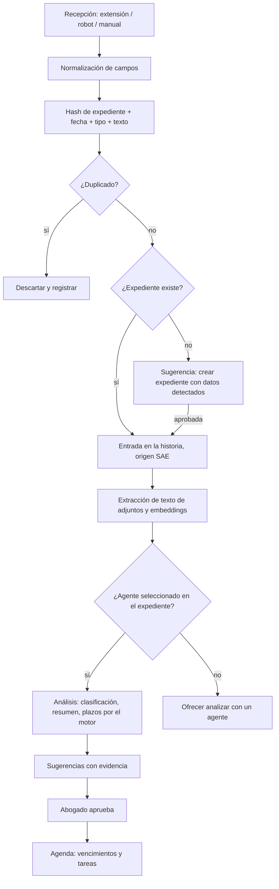

# 09 — Conector con el Portal del SAE

## 1. Qué hay hoy

El Portal del SAE (Sistema de Administración de Expedientes del Poder Judicial de Tucumán, Acordada 640/15) es la vía por la que el abogado recibe notificaciones y consulta sus expedientes. Lo verificado en la ayuda oficial (ayuda-portaldelsae.justucuman.gov.ar) y en el propio portal:

- **No hay API pública** ni exportación de datos.
- Es una aplicación web con módulos: **Bandeja de Entrada de notificaciones** (agrupada por fuero: Civil y Comercial, Familia, Trabajo, Penal, Apremios, etc.), **Consulta Expedientes**, **Estrado Judicial** (avisos públicos, con páginas accesibles sin sesión) y presentaciones digitales.
- **Ingreso con CUIT y contraseña** ("clave informática simple"). La ayuda no menciona doble factor. La firma digital de escritos usa OTP vía firmar.gob.ar, fuera del portal.
- El SAE llama **"historia del expediente"** a la línea de tiempo donde "el informe de las cédulas y demás comunicaciones realizadas podrán visualizarse".
- Regla de cargo confirmada: "los plazos procesales de presentaciones realizadas fuera del horario de atención de tribunales, comenzarán a correr a primera hora del día hábil siguiente".
- Desde cuándo se tiene por notificada una cédula digital (día de disponibilidad en la bandeja o día hábil siguiente): **[a confirmar acordada de la Corte Suprema de Justicia de Tucumán]**. El motor de plazos parametriza esta regla.

## 2. Objetivo del conector

Que las actuaciones del juzgado lleguen a la **historia del expediente** sin que el abogado las transcriba, y que a partir de ahí el agente seleccionado las analice y el motor cuente los plazos (Flujo 0 en `05-integracion-expedientes-ia.md`).

## 3. Vías de incorporación

En orden de prioridad. Las tres desembocan en el mismo pipeline (sección 4).

### 3.1 Extensión de navegador (MVP)

Extensión para Chrome y Edge que trabaja **con la sesión del abogado ya iniciada** en el Portal.

**Qué hace**

- Detecta que el abogado está en el Portal del SAE con sesión activa.
- Lee la **Bandeja de Entrada** de notificaciones (todas las categorías) y, para los expedientes que el abogado marcó como "seguidos" en el sistema, la **historia del expediente** en Consulta Expedientes.
- De cada notificación o actuación extrae: número y año de expediente, juzgado y secretaría, carátula, fecha de la actuación, fecha de notificación, tipo (proveído, cédula, resolución, sentencia, audiencia), texto completo y adjuntos (PDF).
- Envía todo al **endpoint de ingestión** del sistema con un token propio del dispositivo.

**Modos**

- **Manual**: botón "Sincronizar ahora" en la extensión.
- **Automático**: al abrir el Portal, y cada N minutos mientras la pestaña esté abierta.
- Indicador en la extensión: última sincronización, cantidad de novedades enviadas, errores.

**Qué no hace**

- No guarda ni pide la contraseña del abogado.
- No presenta escritos ni realiza acciones en el Portal; solo lee.
- No envía nada a terceros distintos del sistema del abogado.

**Resiliencia**

- Los selectores del Portal se mantienen en un archivo de configuración versionado que la extensión descarga del sistema; un cambio de diseño del Portal se corrige sin reinstalar.
- Si la lectura automática falla, la extensión ofrece "capturar esta página": envía el HTML o el texto visible y el sistema lo interpreta con IA.
- Alerta en la vista Hoy si pasaron más de N días sin sincronizar.

**Ventajas**: sin credenciales almacenadas, funciona aunque el Poder Judicial agregue doble factor, respeta que la sesión es del abogado, difícil de bloquear.

**Limitación**: requiere que el abogado abra el Portal (o deje la pestaña abierta). Por eso existe la vía 3.2 como opción.

### 3.2 Robot en servidor con credenciales (opcional, fase posterior)

Automatización con navegador que ingresa al Portal con el CUIT y la contraseña del abogado y ejecuta la misma lectura que la extensión, sin intervención.

**Diseño**

- Activación explícita por el abogado, con aviso claro de riesgos y responsabilidad.
- Credenciales cifradas en una bóveda con clave derivada de una frase que solo el abogado conoce; el servidor las descifra solo en el momento de ejecutar.
- Dónde corre: función de Vercel con navegador automatizado (el límite de paquete de 5 GB lo permite) o, alternativamente, **tarea programada local** en la PC del abogado (misma lógica, credenciales nunca salen de su máquina). La opción local es la recomendada si el abogado la puede mantener encendida.
- Frecuencia configurable (por ejemplo cada 2 horas en horario de tribunales).
- Se apaga solo ante fallos repetidos de login, cambios de diseño o cualquier señal de bloqueo, y avisa.

**Riesgos específicos**

- Guardar credenciales de un sistema judicial.
- Términos de uso del Portal: verificar si prohíben accesos automatizados **[a confirmar]**.
- Bloqueos por IP o por comportamiento; captchas.
- Si el Poder Judicial agrega doble factor, el robot deja de funcionar.

### 3.3 Carga manual asistida (siempre disponible)

- Pegar el texto de la notificación o subir el PDF/imagen (con OCR).
- El sistema detecta expediente, fecha y tipo, crea la entrada en la historia y dispara el análisis.
- Es la vía de respaldo cuando la extensión no puede leer, y la única vía para actuaciones anteriores a la adopción del sistema (carga histórica).

## 4. Pipeline de ingestión

Registro: cada importación guarda el payload crudo, el hash, el dispositivo o robot de origen, el resultado (creada, duplicada, pendiente de vinculación) y el id de la entrada creada. Permite auditar y reprocesar.

## 5. Cómputo de plazos desde la notificación

- La entrada importada trae la **fecha de notificación** (de la bandeja) y la fecha de la actuación.
- El Analista identifica el acto que abre plazo y lo busca en el **catálogo de plazos del abogado**; si no está, propone agregarlo y no calcula.
- El motor de plazos aplica: regla de inicio de la notificación digital **[a confirmar]**, días hábiles judiciales, feriados y ferias, plazo de gracia si corresponde **[a confirmar]**, y la regla confirmada de presentaciones fuera de horario.
- El vencimiento propuesto lleva la explicación paso a paso y la referencia a la entrada de la historia que lo originó.

## 6. Seguridad y cumplimiento

- Token por dispositivo para la extensión, revocable desde la aplicación; un token solo puede escribir en los datos del abogado que lo generó.
- La extensión pide únicamente permisos sobre el dominio del Portal y el del sistema.
- Registro de cada sincronización (qué se leyó, cuándo, cuántas entradas).
- Para el robot: bóveda cifrada, activación explícita, apagado automático ante anomalías, revisión de términos de uso.
- Los datos importados son del abogado y quedan bajo las mismas políticas de confidencialidad que el resto del sistema.

## 7. Riesgos y mitigaciones

| Riesgo | Mitigación |
|---|---|
| El Portal cambia su diseño | Selectores versionados descargables; modo "capturar esta página" con interpretación por IA; alerta al abogado. |
| El abogado no abre el Portal por días | Alerta en Hoy; opción de robot; carga manual. |
| Notificación mal vinculada a un expediente | Vinculación por número/año/juzgado con confirmación cuando hay ambigüedad; corrección manual con reasignación. |
| Duplicados | Hash por contenido; revisión de duplicados sospechosos. |
| Bloqueo o prohibición de automatizaciones | La extensión opera con la sesión real del abogado; el robot es opcional y se apaga solo. |
| Fecha de notificación incorrecta | Se muestra la fecha leída y la regla aplicada; el abogado puede corregirla y el vencimiento se recalcula. |

## 8. Funcionalidad

### MVP

- [ ] Endpoint de ingestión con token por dispositivo, deduplicación y vinculación automática.
- [ ] Extensión para Chrome/Edge: lectura de la bandeja y de la historia de expedientes seguidos, modos manual y automático, indicador de estado, modo "capturar esta página".
- [ ] Selectores versionados descargables desde el sistema.
- [ ] Carga manual asistida (texto, PDF, imagen con OCR).
- [ ] Entrada en la historia con origen SAE y disparo del Flujo 0.
- [ ] Alerta por falta de sincronización.
- [ ] Registro de importaciones auditable.

### v2

- [ ] Robot opcional (local o en servidor) con bóveda de credenciales y apagado automático.
- [ ] Lectura del Estrado Judicial público para expedientes seguidos.
- [ ] Carga histórica masiva de expedientes existentes.
- [ ] Informe de estado automático al llegar una notificación.
